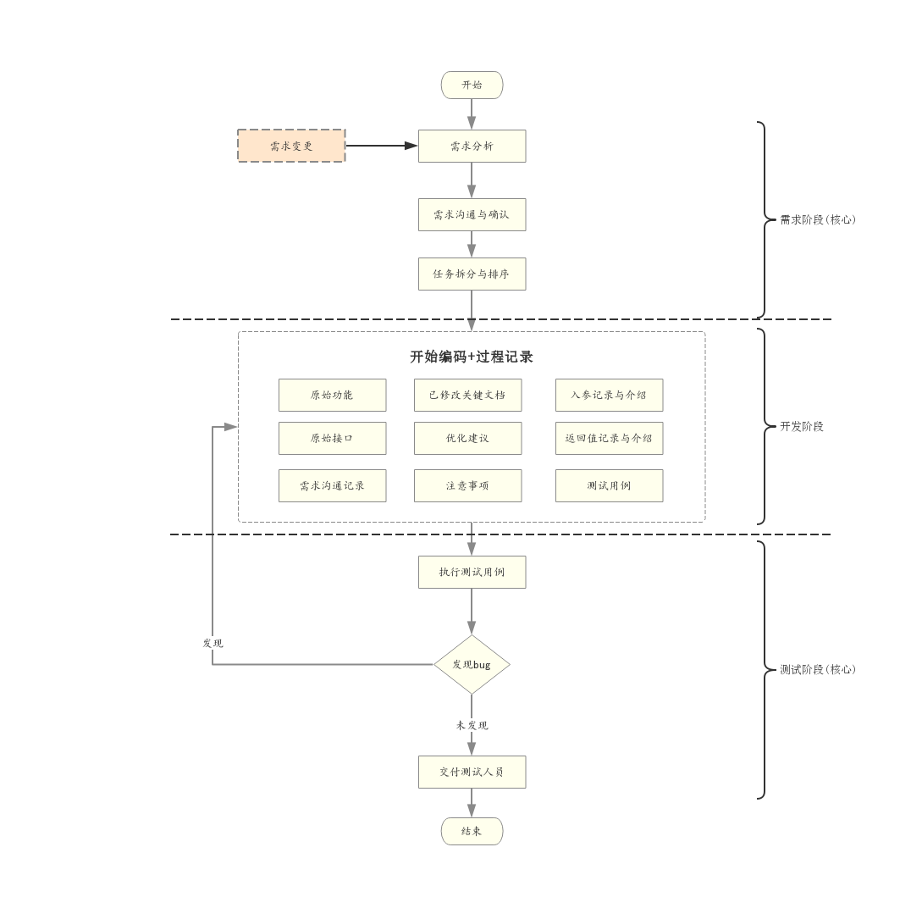
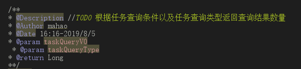

**一、研发过程中遇到的问题？**

研发的过程既是创造的过程，既然是过程那么必然涉及时间的消耗、精力的消耗、待处理目标、处理结果等要素，面对这样复杂的事务如果我们没有一套适合自己的研发流程与规范，那么或多或少必将面对如下问题：

<!-- more -->

1、研发耗时长

2、研发过程反复

3、研发过程不可控

4、实际成功与预期目标存在巨大差异

5、易产生不可预知的bug

6、影响研发人员心情乃至拖延整体团队进度

......

**二、如何建立良好的研发流程与规范？**

流程与规范不是枷锁，而是提升工作效率的催化剂，适合自己的才是最好的。

良好的研发流程与规范应该具备如下要素：

- 充分的沟通
- 全面的思考
- 对目标结果的清晰预期
- 对过程的强力把控
- 具备约束力
- 符合自己的做事风格

结合自身实际情况现将本人总结的研发流程与规范进行分享，如下图：

**三、案例分享**

**---需求分析**

1、非延期--今天代办：到期日期<=当前日期，且非延期任务（不显示无到期日期的任务）

2、非延期--最近七天代办：到期日期<=当前日期+6天，且非延期任务（不显示无到期日期的任务）

3、非延期--所有代办：包括无到期日期，且非延期任务

4、延期处理---原条件不变，即延期任务

5、排序记录：前端通过浏览器storage实现持久化存储

6、列表数量查询接口更新

**---涉及到的原始接口**

40002/taskCentre/task/query/list 列表查询接口

40002/taskCentre/task/countTodoTaskAndDelayTask 列表数量查询接口

30032/api/GeneralSetting/GetGeneralContentBykey 任务分类获取接口

**---优化建议**

问题：测试时发现在我的代办任务种点击不同的任务分页都会调用一遍列表、数量、分类三种接口，其中数量、分类着两种接口数据是固定的无需每次切换分页都要调用。

建议：第一次点击我的代办任务时调用三种接口，后期即使切换分页也只需调用list接口和list数量接口即可。

**---注意**

1、需要将历史facade版本合并到master，并从master拉取最新代码到0814

2、非延期任务状态后端枚举是否需要设定对应的基础信息–不需要（任务延期状态也没有配置）

3、如果当前用户拥有管理视角且具备企业数据权限，则将查询系统内所有任务。如果只拥有管理视角，则查询自身以及下属任务。

**---facade-api**

com.yqn.order.facade.vo.request.taskcenter.TaskQueryVO L116

com.yqn.order.facade.vo.response.taskcenter.TaskCountVO

**---facade-service**

com.yqn.order.facade.manager.TaskManager L471

com.yqn.order.facade.service.TaskQueryFacadeServiceImpl L276

**---task-api --需要将api发布到maven**

com.yqn.task.enums.TaskNotDelayStatus 新建

com.yqn.task.dto.task.TaskQueryDTO L193

com.yqn.task.dto.search.TaskSearchReqDTO L226

**---task-service**

com.yqn.task.transfer.TaskSearchTransfer L155

com.yqn.task.manager.search.TaskSearchManager L166,L186,L426

com.yqn.task.util.DateUtil L133

**---测试接口参数案例**

1、列表查询接口

xUserId：0 ---必填

{ 

delayHandleStatus: 1,

notDelayHandleStatus：0, 

isManager: false, ---必填 

page: 1, ---必填 

size: 20, ---必填 

sort: [] 

}

2、列表数量查询接口（理论上其参数是要同列表查询接口保持一致）

**---测试用例**

https://docs.qq.com/sheet/DWlFXdm53TXBnaVRP?opendocxfrom=admin&preview_token=&t=1565004059930&coord=K46C0Z0&tab=BB08J2

**四、编程规范**

将编程规范放在最后去讲，这并不代表编码规范不重要，编码规范因编程语言、所在团队、个人习惯而异，简单来说需符合一下标准：

1、遵循项目架构---不同任务功能集成至相应项目

2、符合调用层级关系

3、注意功能的拆分与封装

4、接口、类、方法注释明确---方便自己合其他人阅读

5、函数内清晰的处理逻辑与注释

6、在满足以上五条的基础上实现性能提升

......

***---转载请标明出处---***

:smile::smile::smile:

**[monkeyGeek](monkeyGeek369.github.io)**

