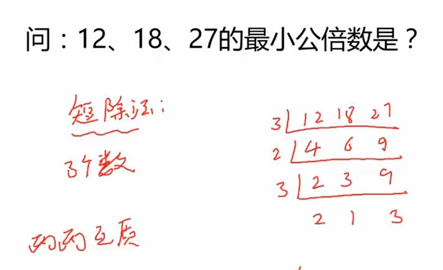
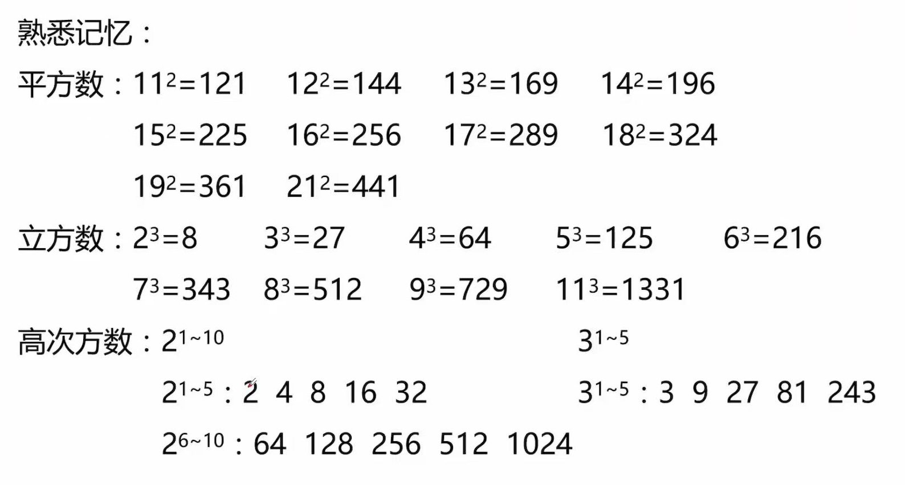
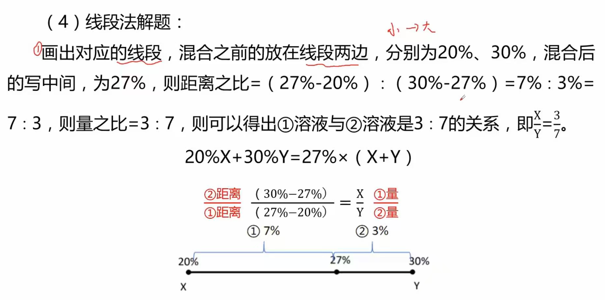

# 数量关系

- 掌握解题技巧
- 大量刷题
- 逻辑思维解题:逐步骤、不跳跃、工整解题不错乱

# 基本概念

* 素数：即质数，大于1且只能被自己和1整除(必须两个,1不是因为只有一个)，不能被其它数整除.例如3只能被1或3整除，4可以被1/2/4整除，因此不是素数.2是唯一偶数质数
* 任何一个大于1的自然数要么是素数,要么可以拆解为一系列素数的乘积
* 自然数:正整数
* 倍数:存在一个数k使a=k*b,则a是b的倍数
* 公倍数:两个及以上数的共同倍数,例如10是2和5的公倍数
* 约数:能整数A都数叫做A的约数.例如1,2,4,8是8的约数
* 最大公约数:两个数的约数中公共最大的数.例如6和8的最大公约数是2
* 因子:如果a=k*b,且abk均为整数,且b!=0则b是a的因子
* 除法关系:a/b=c则a为被除数,b为除数,c为商
* 子午线:即经线连接南北两极的半圆,经度向东到180度(东经),向西到180度(西经)
* 纬度:从赤道0向北极90度,到南极90度,其中1度=60‘角分,1’角分=60‘’角秒
* 短除法:（分解到任意两个数除1外再无公约数）
最大公约数:所有左侧公共质因数的乘积，因此为3 (因为后续三个数没有全部参与运算)
最小公倍数:所有左侧x最后一行 3 * 2 * 3 * 2 * 1 * 3

* 其它

# 数字推理

- 解法:优先识别是不是特征数列、再看是不是多级数列、递推数列
- 特征数列(重点)
  - 多重数列(常考二层)
    - 特征:项数多(>=7项,包含所求项)优先考虑
    - 解题思路:
      - 先交叉(奇数项/偶数项)：交叉后是否有规律
      - 再分组(两两分或三三分)：分组后判断关系
      - 直接分组:考虑加减乘除
  - 分数数列
    - 反约分：分母约相同、分母约等差、分子约相同、分子约等差
    - 分别观察分子、分母是否有递增/递减
    - 案例1/7、1/4、1/3、()、5/11、1/2,反约分为1/7、2/8、3/9...(反约分要结合前后项)
  - 机械化分数列
    - 特征:全是小数(点就是分隔符)、数列中大数字多(三位数/四位数及以上,如126,253,225...)
    - 解题思路:先拆分,再找规律
      - 内部规律：如112分为1.1.2和为3
      - 奇偶规律：如5.11,6.10……中5/6为等差数列
      - 和差规律：如3.8,5.11……中差分别为5/6
  - 幂次数列（弱项）
    - 特征:本身是幂次数(4/9/16)、附近有幂次数(7[=2立方-1]/26/63)如7的附近8为幂次数
    - 解题思路:
      - 普通幂次数(直接还原)
      - 修正幂次数(底数递增指数不变+-修正项)或者（低数不变指数递增+-修正项）或者（有时加减是交替出现）
      - 熟悉常见幂次数

- 非特征数列(重点)
  - 多级数列
    - 特征：无明显特征且变化平缓（逐渐递增或递减，例如20/28/35/51/69/94/130）
    - 解题思路：
      - （多次做）相邻两两做(差/和/商)
      - 观察数列特性，例如差/比/质
  - 递推数列
    - 特征：无明显特征、非多级数列
    - 相邻三项间找规律
      - 例如：5,7,4,9每三项有（5-2）平方=4
    - 变化平缓：使用和/倍：例如2,3,9,18每三项有2 * 3 + 3 =9，3 * 3 + 9 = 18
    - 变化趋势大：使用积/方
  
- 基础数列
  - 等差数列:相邻数字间差相等
  - 等比数列:相邻数字间商相等
  - 质数数列:由质数组成的数列,2是唯一偶质数
    - 2、3、5、7 和 11，13 后面是 17，
      19、23、29，31、37、41，
      43、47、53，59、61、67，
      71、73和79，83、89加97
    - 25个质数不能少;百内质数要牢记.
  - 简单递推数列:后一项由前项递推得出,主要考察四项递推
    - 递推和:例如1,2,3,5,8前两项合为第三项
    - 递推差:例如12,7,5,2,3前两项差为第三项
    - 递推积:特点速度增加很快
    - 递推商:特点也速度减少很快
  - 合数数列:
    - 乘积和数：如10=2*5
    - 复合和数：如11（2 * 5+1）、10（2 * 6-2）、17（2 * 7+3）、12（2 * 8-4）
  - 周期数列:数字或符号存在周期性循环(例如1.5,2,0,5,2,0中5,2,0周期循环)
  - 解题策略
    - 看递增还是递减

# 解题技巧

* 代入排除法
  * 年龄问题:如问相差几岁、当前年龄多少
    * 年龄差列等式：年龄差不变，如“我在你这个年纪你才12岁，等你到我这个年纪，我都69了”，可得x-12=69-y
  * 余数问题:如除a余几、拿走一个剩余能被a整除等
  * 多位数:个十百相互换位置、倒序后相加减
  * 不定方程:一元二次、多元一次
  * 没思路，不会做的题
  * 注意：一般结合倍数、奇偶、尾数等特性先排除再带入

* 奇偶特性
  * 特点：当题目中的系数有奇偶特点时使用，如3x+4y=14
  * 奇+-奇=偶，偶+-偶=偶，奇+-偶=奇
  * 奇x奇=奇，奇x偶=偶，偶x偶=偶
    

* 倍数特性
  * 特点：ax+by=M当a或b与M存在倍数关系时考虑使用
  * 余数型
    * 常见类型：平均分、有剩余/缺少、求总数
    * 例如：有x块糖，每人平均分10块还多3，求糖总数
    * 解体方法：对总数多退少补，再找倍数
  * 比例型
    * 关键先从题目中挖掘比例关系
    * 例如某班男女比例是7:4则可以得到如下推导前提是不可以再约分
      * 男生=7倍数
      * 女生=4倍数
      * 总人数=11倍数
      * 差=3倍数
      * 男/总=7/11
      * 女/总=4/11
      * 男生=女生的7/4倍
    * 适用于倍数/百分数/分数/比例/分组
      * 例如:今年男员工比去年减少6%,可以得出今年:去年=47:50
      * 平均分组、平均分x组余y
    * 快速记忆
      * A是B的3/5则A/B=3/5
      * A比B多3/5则A/B=8/5
      * A比B少3/5则A/B=2/5
  * 如何快速计算选项的倍数
    * 直接除
    * 2/5/10看尾数：如5倍数的尾数只能是0或5
    * 3/9看各项位数加和：如将54321个位数相加为15，则是3的倍数不是9的倍数
    * 加减拆分：142是否为7的倍数，拆成7的若干倍+-较小的数。142=140+2，重点看2是否为7的倍数
  * 深刻理解
    * 如果x*y=z且z是某数的倍数，则x或y中至少有一个是某数的倍数(前提是某数为素数)
    * 当遇到x*y=z时,尝试拆解z为素数的倍数,再求解
    * 寻找共同倍数(一般是最大):例如已知18x+23y=300求解y?可知18与300都是3、6的倍数,计算可知x只能为6
    * 因子倍数：例如x=a*b*c，则abc都属于x的因子，都可以整除x。某个数的因子依然有子因子，则这个数是子因子的倍数
    * 最小公倍数特性:如果一个数被a、b整数有相同余数,则这个数被ab的最小公倍数整数可有相同的余数
      * 一般利用最小公倍数设为总数,再根据题目反推具体数目

* 尾数法
  * 特点：ax+by=M当a或b的尾数是0或5时考虑使用
  * 尾数举例
    * 尾2+尾5=尾7
    * 尾7+尾6=尾3
    * 尾2-尾8=尾4
  * 一个数能被2或5整除，则末1位可以被2或5整除
  * 一个数能被4/25整除，则末2位可以被4/25整除(2/5的平方)
  * 一个数能被8/125整除，则末3位可以被8/125整除(2/5的立方)
  * 一个数能被3/9整除，则各个位数字之合能被3/9整除
  * 模九同余特性:一个数除9的余数=各位和除9的余数
  * 用0-9这是个数组成若干1位、2位、多位数(每个数字用一次),把他们相加的和一定是9的倍数

* 普通方程：未知个数=方程个数
  * 设未知数
    * 求谁设谁:一般直接设x,特殊情况可以设最小公倍数,例如42x
    * 设小不设大:例如甲是乙的2倍,丙是乙的3倍多3,则应设乙为x(核心是通过设小可以表示大部分数)
    * 设中间量：例如A组占全员1/3,B组占全员1/2，可以设全员为6x求解
    * 按比例倍数设:例如甲车行至全程2/5时可设全程为5x，或者A/B为3/5可分别设3x和5x
  * 列方程组：题目出现和差倍比关系与等量关系时根据关系列公式计算
  * 其它常见设法
    * 年龄或数字互换问题/个位与是十位互换：10a+b换为10b+a

* 不定方程：未知个数>方程个数
  * 形式：3x+7y=95
  * 方程组：一般考三个未知数，两个方程的形式。需要先消元转化为不定方程形式，再求解
  * 奇偶特性求解
    * 特点：系数与值存在奇偶特点
    * 例如3x+4y=20求解，3x一定为偶数，近一步尝试代入求解
  * 倍数特性求解
    * 特点：系数与值存在倍数关系
    * 例如11a+7b=121其中7b一定是11的倍数
  * 尾数法求解
    * 特点：系数与值存在倍数特性
    * 被5整数后余4则尾数一定为4或9
    * 例如3x+10y=41则3x的位数一定是1
    * 例如12x+5y=99
  * 代入法求解
    * 特点：计算量不大且无其它思路
  * 赋0法
    * 特点：未知数为时间/钱时求总和
    * 例如：aX+bY+cZ

# 工程问题

* 工程总量w=效率e*时间t
  * 时间一定:w与e成正比
  * 效率一定:w与t成正比
  * 总量一定:e与t成反比
* 给定时间型
  * 从头到尾完成工作所用时间，中间停留无中断
  * 解题思路如下
  * 1.赋值：总量赋值为时间的最小公倍数（例如甲完成工程需要30天，乙完成工程需要45天，则工程应该赋值为90来求解）
  * 2.求效率：第一步赋值完成后求效率
  * 3.进一步根据题意注解
* 效率制约型
  * 出题形式
    * 1.直接得到效率比：如甲乙的工作效率比是2:3
    * 2.由效率差异百分比推导：如工艺优化后生产效率提升了20%，隐含条件是优化前效率与优化后效率比为1:1.2或5:6
    * 3.效率相同性推导：如某农场现在有42台收割机，隐藏信息是每一台的效率相同
    * 4.某工程的一部分甲完成需要5天，乙完成需要3天则隐藏的甲乙效率比是3:5
  * 解题技巧(解题的关键是找到效率比)
    * 1.列表：w=e*t
    * 2.赋值：根据效率比赋值效率（例如甲乙效率比为2:3则直接赋值甲的效率为2乙的效率为3）
    * 3.根据其它给定条件求出w和t
* 分段计算型
  * 特指：给定了具体带单位的工作效率或工作量（时间不算）例如“修路，每天50米”
  * 解题技巧
    * 设未知数
    * 找等量列方程
    * 分段工作:借助画线段辅助（适合已知效率和分段工作场景）
* 同开同结
  * 先求总用时（w总/e总）
  * 再求各种的工作量和时间
* 产量最大
  * 例如甲乙生产a和b的效率各不相同，问两人合作最多可以生产多少？
  * 解题思路
    * 先各自算出效率比（a或b谁生产的效率最高）
    * 然后效率最高的去多做它擅长的
    * 结合题目解题

# 行程问题（重难点）

* 解题思路
  * 不要懒，要画图
  * 追及相遇问题的核心是根据题目条件找到追及相遇时各方的s、v、t或者比例关系、相关性
* 基础公式(很重要)
  * 路程s=速度v*时间t
  * 路程固定，速度和时间成反比
  * 速度固定，路程和时间成正比
  * 时间固定，路程和速度成正比
* 火车过桥问题
  * 火车完全过桥：s=桥长+车长
  * 火车完全在桥上：s=桥长-车长
* 等距离平均速度
  * 概念：例如从家到学校的速度是v1从学校到家的速度是v2，求一个来回的平均速度。
  * 公式：平均速度=(2* v1 *v2)/(v1+v2)这个公式可以自行推导
  * 题型：上下坡问题、往返问题、前半程后半程问题
  * 如何理解等距离?所谓的等距离即两个速度v经过的距离相同.例如一段上坡一段下坡,且上下坡距离不同,但存在往返则可用等距离平均公式
* 逆水行舟问题
  * 公式：v顺=v船+v水、v逆=v船-v水
* 相遇问题
  * 相遇场景：两者从两地分别出发相遇而行
  * 相遇公式：距离s=(v1+v2)*时间t
* 追及问题
  * 场景：两者同时出发前往相同目的地，但一个距离更近一些而距离远的速度更快
  * 公式：距离差S距=(v1-v2)*t
  * 解题技巧是需要多长时间才能完成距离差赶超
* 环形跑道问题
  * 形式一同起点反向而行，问相遇问题
  * 形式二不同起点同向而行，问追及问题
  * 解题思路：记清楚到底走了多少圈再去解题
* 两端相遇问题
  * 形式：例如上海与北京的高铁路线，两列火车分别从两地出发并且不断往返，用线路长s
  * 问题形式：第几次相遇问题(关键找共同走了多少距离)
  * 解题公式：第一次经历s第二次3s第三次5s，第n次为(2n-1)s
* 等时间平均速度
  * 若物体前一段时间以v1后一段时间以v2运动,则平均速度为(v1+v2)/2
* 钟表问题
  * 时针速度=30度/60分钟=0.5度/分钟=30度/小时
  * 分针速度=360度/60分钟=6度/分钟
  * 角度差:6-0.5=5.5度/分钟
  * 追及距离=追及时间*5.5度/分钟

# 经济利润问题

* 基本经济利润
  * 基本公式
    * 利润=售价-成本
    * 利润率=利润/成本
    * 售价=成本*（1+利润率）
    * 折扣=折后价/折前价
    * 总价=单价*销量
    * 总利润=利润*销量=总售价-总成本
    * 亏本=总售价-总成本（最好不要总利润计算）
  * 解题方法：
    * 代入法：适合题目条件少
    * 方程法
    * 赋值法：适合没有带具体单位，赋值不影响结果的场景（赋值价格/数量）
    * 列表法（成本、售价、利润、数量）
  * 解题技巧
    * 案例一：如果a+b=10则，ab的最大值是5的平方，如果a+b=n则，ab的最大值是n/2的平方.类似一元二次方程求最大值的问题可以用此方法
* 分段计费问题
  * 解题方法
    * 分段计算，结果汇总
    * 总画线段来理清思路
    * 有时要猜测主体在那个区间最合适（只能用分类讨论）
* 函数最值问题
  * 题型特征：单价或单利和销量此消彼长，问何时总价或用利润最高
  * 解题方法
    * 两点式
      * 设提价或降价次数为x次（无论问谁设的都是提价或降价次数）
      * 列方程：总价/总利润=（）*（）
      * 令y=0求得x1x2，当x为（x1+x2）/2时取得最值
    * 一元二次方程y=ax2+bx+c的最大值是x=-(b/2a)时,求根公式为r=(-b+-根号下[b方-4ac])/2a

# 排列组合

* 排列 A(array)
  * 场景：
    * 一、例如n个人排队有几种排列方式
    * 二、例如n个人选3人去排队有几种方式
  * 算法：n*(n-1)*(n-2)…1也就是n！
  * 特点：有顺序性
  * 表达式:A(3/n)
* 组合 C(combination)
  * 场景：例如从6人中选3人去食堂打饭
  * 算法：C(3/6)*A(3/3)=A(3/6)因此C(3/6)=A(3/6)除A(3/3)简化一下是6x5x4除以3x2x1
  * 解读：从六人选三人是无序的，乘以，从3排队是有序的，等于从6人选出有序的3人
  * 特点：无顺序性
  * 等价关系：C(n/m)=C([m-n]/m)
  * 案例：
    * 例一：甲乙丙三个班参观博物馆，每天博物馆只能接待一个班级，甲参观了连续的两天，其余两个班各一天，有几种可能？此时不能是C(4/5)*A(2/3)而是甲的4种可能乘以A(2/3)！思考～并非所有的可能性都要表达成排列组合再运算，会出错的。
* 分类分步
  * 分类相加：有多种情况都可以完整把事情做完。可以理解为“要么……要么……”
  * 分步相乘：事情需要分步完成，每一步都必不可少。可以理解为“即……又……”
  * 正难则反
    * 正面情况多且不好讨论，可以考虑反面（正难则反可以用在非概率问题上）
    * 逆向公式：满足条件=总数-不满足
  * 注意事项
    * 能用分类，不要轻易用组合：不能单纯理解为从集合中无序的选对象，这个的前提条件是，题目没有限制条件，例如捆绑限定等
* 常见解法
  * 捆绑法：
    * 特点：在一起、相邻、相连
    * 先捆绑再组合
  * 插空法：
    * 特点：不相邻、不相连
    * 先排其它元素，再将特殊元素插空
    * 注意：是否要求顺序性、是否涉及到多次插空（必须分步骤插空，例如插入A后空数变化了）
  * 插板法：例如有十个橘子，分给三个人，每人至少一个。思路是十个橘子有九个空，三个人两块板，因此是C(2/9)。特点是相同物品且至少分一个。
  * 错位排列：例如5个厨师分别做菜，要求不能品尝自己的菜，有几种可能。
    * 记住D3=2,D4=9,D5=44重点记后面两个
* 概率问题
  * 题目中没有概率：找到分子和分母
  * 题目中有概率：概率的分步相乘或分类相加。例如：八人分四组，问小明和小李分在同一组的概率。先分小明8/8再分小李1/7两者相乘就是1/7
  * 正难则反：概率=1-不满足条件的概率
* 总结：题目往往是对分类、分步、正难则反、捆绑、插空、插板、错位排列的混合使用，不是单独某一个

# 计算问题

* 基础运算
  * 尾数：所列式子只有加减乘，且选项尾数不同
  * 倍数：结果是某数倍数时使用
  * 凑整：遇到9,99,999时先凑整再运算
  * 基础公式
    * 提取公因数：ac+-bc=（a+-b）*c
    * 平方差：a方-b方=（a+b）*（a-b）
    * 完全平方公式：（a-+b）方=a方+-2ab+b方
    * 定义新运算：按照定义规则计算，先括号内外括号外，先乘除后加减
* 等差数列
  * 通项公式：An=A1+(n-1)d
  * 求和公式：和=1/2（首项＋末项）x项数=平均数x项数=中位数x项数
  * d为每一项的差值
  * Am+An=Ai+Aj其中m+n=i+j
* 等比数列
  * Q表示等比数列公比
  * 通项公式：An=A1*Q[n-1]
  * 求和公式(通过错误相减法推导)：Sn=A1(1-Q[n次方]) 除 1-Q
  * Am * An=Ai * Aj其中m+n=i+j

  
  

# 最值问题

* 最不利构造
  * 问法:“至少xxx才能xxx”
  * 案例
    * 口袋有3黑4红5白，问至少摸几个球才能保证一定有一个白球?答案8
    * 有语文，数学，英语三门课，每人只能选两门，问至少多少人才能保证至少有6人选择相同的课？
  * 解题技巧：
    * 有时要先结合排列组合列出所有可能情况
    * 再找最倒霉的情况,最不利值+1
* 数列构造
  * 题型：题目中有，最多…最少…、在排名第几…最多/最少
  * 案例：100只笔分给3人，每个人分的都不同。问分的最少的人最多能分几个？
  * 解法：
    * 排序：假设由高到低排序abc三人
    * 设值：一般求谁设谁，c=x
    * 构造：假设c分得x只笔，c最多能分几只则意味着a+b要尽可能的少。因此b最少是x+1,a最少是x+2
    * 求和：3x+3=100则x等于32.几，这里就意味着最大也就这个数，最多的整数也就32了
  * 注意：如果没有每个人分的都不同的限制，则其它对象应该都是一样的，例如x+1
* 多集合反向构造
  * 题型：题目中出现至少……都……
  * 案例：某社团46人，其中35爱戏剧，30爱体育，38写作，40收藏，问至少有多少人都喜欢？
  * 解法：
    * 反向：假设不喜欢戏剧有11，不喜欢体育16，不喜欢写作8，不喜欢收藏6
    * 求和：以上不喜欢的求和为41
    * 做差：46-41=5
  * 原理解释：题目问的是都喜欢最少，因此不都喜欢应该最多，所以反向取值的数值假定是都不喜欢的且没交集，因此计算出反向的和来做差(反向求和做差)

# 几何问题

* 计算公式
  * 周长
    * 圆：2派R
    * 弧长：(n/360)*2派R
    * 扇形：弧长+2R = (n/360)*2派R+2R
  * 面积
    * 矩形：a*b
    * 三角形：1/2（底*高)
    * 平行四边形：<u>底*高</u>
    * 梯形：1/2(上底+下底)*高
    * 圆形：派*R的平方
    * 扇形：(n/360)x(派*R的平方)
    * 菱形：<u>（对角线乘积）/2</u>
  * 表面积
    * 立方体：2ab+2bc+2ac
    * 正方体：6a平方
    * 球形：<u>4派xR的平方</u>
    * 圆柱：2派r的平方+2派rh
  * 体积
    * 立方体：长x宽x高
    * 正方体：a的3次方
    * 球体：<u>(4/3)派xR的3次方</u>
    * 圆柱体/棱柱：底面积x高
    * 锥体/棱锥：<u>(1/3)底面积x高</u>
* 数学定理
  * 三角形
    * 勾股定理：a方+b方=c方
    * 常见：<u>（3n、4n、5n）和（5n、12n、13n）其中n为等比例扩大</u>
    * 30度角直角三角形：1:根3:2
    * 45度角直角三角形：1:1:根2
    * 多个三角形存在公共边
      * 高相等时，面积之比等于底之比
      * 底相等时，面积之比等于高之比
    * 相似三角形
      * 对应边比=相似比
      * 面积比=相似比的平方
  * 多边形
    * 外角和为360度，因此可以计算正多边形内角是多少
    * 必须掌握对角线与边快速推算，垂线与边快速推算
  * 等比例缩放
    * 场景：一个几何图形，边长变为原来的n倍
    * 面积为原来的n平方倍
    * 体积为原来的n立方倍
* 经验常识
  * 假设长度一定，围成面积最大为圆，最小为正方形
  * 假设面积一定，周长最大为圆，最小为正方形
  * 计算距离最短可以考虑使用某一点镜像的方式

# 计数问题

* 植树问题
  * 题型特征:涉及路长、间距、棵树三个量
    * 段数=路长/间距
    * 路长= 段数*间距
    * 间距=路长/段数
  * 基础植树
    * 两端植树:两端都可以植树
      * 课数=段数+1
    * 环形植树/单端植树:只有一端可以植树
      * 棵树=段数
    * 楼间植树:两端都不植树
      * 课数=段数-1
  * 不移动植树
    * 题型特征:原来每隔3米种树,现在要求每隔2米种树,问有几棵树不要移动?/有几棵树需要移动(增加)?
    * 解题方法(核心求最小公倍数)
      * 不移动间距=两次间距的最小公倍数
      * 不移动段数=总长/不移动间距
      * 两端植树:不移动棵树=不移动段数+1
      * 环形植树:不移动棵树=不移动段数
      * 楼间植树:不移动棵树=不移动段数-1
      * 移动棵树=总数-不移动棵树
* 方阵问题
  * 正方形实心方阵
    * 总人数=n平方
    * 最外层人数=4n-4
    * 相邻两层人数相差8人
  * 长方形实心方阵
    * 总人数=n * m
    * 最外层人数=2 (m+n)-4
    * 相邻两层人数相差8人

# 混合比例问题

* 核心公式：浓度=溶质/（溶质+溶剂）
* 赋值法
  * 例如：已知某溶液浓度为a%，第一次加入b克水，第二次也加入b克水，第三次加入b克水，前两次溶液浓度给出变化值，求第三次。类似这种
  * 可以赋值溶质、溶剂为具体数值满足条件，然后设每次加入溶质量为x，根据核心公式求解
* 线段法
  * 案例:浓度为20%的盐水x克与30%的盐水y克,混合为27%的盐水.问x与y的比值?
  * 适应题型:浓度、利润率、增长率、比重、平均数、平均数，且满足混合的关系
  * 推导:根据混合前后溶质不变,找等量关系x * 20% + y * 30% = (x+y) * 27%
    * x/y = (30%-27%)/(27%-20%)
    * 可以理解为:x量/y量 = y距离/x距离
    * 即:距离与量成反比
  * 操作步骤
    * 混合之前写两边,混合之后写中间
    * 距离与量成反比,看好份数再计算
    * 注意:量指分母（而不是变化量）.浓度计算时分母为溶液,利润率问题是分母为成本

# 容斥问题

* 两集合
  * 标准解法
    * A+B-A交B=总数-都不
  * 画图法
    * 每个封闭区域内只标一个数字，代表其面积。
    * 线上标数字表示线内所有区域的和
    * 使用条件：题目出现只满足一个条件时、公式法解决不了时
    * 重点是一定要遵守上述规范
* 三集合
  * 标准解法
    * A+B+C-A交B-A交C-B交C+A交B交C=总-都不
  * 非标准解法：题目中出现满足关键字时使用
    * A+B+C-只满足两个-2满足三个=总数-都不=>A+B+C-(a+b+c)+2d
  * 画图法：与二集合相同
* 多集合标准：解法同多集合反向构造，反着想问题

# 牛吃草问题

* 题型：
  * 牛吃草：240头牛吃6天，200头牛吃10天
  * 挖沙子：80人连续开采6个月，60人连续开采10个月
  * 检票：同时开4个检票口需50分钟，同时开6个检票口需30分钟
  * 水池：5台抽水机40小时可以抽完，10台抽水机15小时可以抽完
  * 泄洪：打开10个泄洪闸8小时可以恢复安全水位，打开6个需要24小时
* 如何判定题型为“牛吃草”
  * 有一定的存量，既在匀速增加，又在消耗
* 如何解题
  * 设存量为y份，单位增量为x份(单位可以是天/小时等)
  * 设消耗量为具体数值，例如假设一头牛每天吃一份草。(240-x)X6=y与(200-x)X10=y解方程

# 循环周期问题

* 核心点：若一串事物以T为周期，且A除T=N余a，<u>那么第A项就是第a项</u>.例如9/2=4余1
* 如果可以整除，那么第A项就相<u>当于周期当中的最后一项</u>，即第T项

# 星期日期问题

* 平年与闺年：
  口诀：四年一闰，百年不闰，四百年再闰。
* 大月与小月：
  大月31(1, 3, 5. 7. 8. 10, 12);
  小月30天(4、6、9、11月）
* 2月 平年: 28 闰年: 29天 
* 平年：365天 闰年：366天
* 总天数:开始日期与结束日期都计算在内(例8.8到8.15共8天,7.1到10.1共93天[31+31+30+1])
* 相差天数:总天数-1
* 星期增量关系
  * 若日期相差天数为7的倍数则两者在星期上相同
  * 若日期相差天数整除7有余数n,则星期增长n天.(例如7.1与10.1相差92天,则10.1比7.1星期整长1天)
* 注意
  * 无论从周几开始算，连续的七天一定有一个周日，连续的14天一定有两个周日，连续的21天一定有3个周日，连续的28一定有4个周日。用于计算有几个日期的题目

# 比赛问题

* 淘汰赛：每次比赛淘汰一方，一次淘汰一半
* 循环赛
  * 单循环：每支队伍都要和其它队伍比一场。总场次为C2/n
  * 双循环:每支队伍都要和其它队伍打两场(主场，客场)。总场次A2/n

# 剪绳问题

* 对一根绳子剪N刀总共有N+1段
* 扩展：对一根绳子对折三次从中间剪一刀，有几段？9段。因为对折三次总共有8股，相当于剪8刀

# 天平问题

* 默认选答案的最小值就行了
* 案例：9个硬币中有一个假币，假币重量与真币不同，如何用最小的次数借助天平称出假币？最少2次。第一次3个一组称量，第二次，找到问题的一组单个硬币称量
* 公式:当有M枚硬币,其中一枚为假币,则3[n-1次方] < M <= 3[n次方],其中n为最小次数

# 空瓶换酒

* 我们将“M个空瓶换1瓶酒”，转化为“（M-1）个空瓶换1个（无瓶）酒”来完成答题，这样的题目我们默认是可以“借瓶再换瓶”的
* 例如12个空瓶可以换1瓶酒，那么101个空瓶可以换多少？答案是101除11=9瓶

# 拿牌问题

* 【例1】一副扑克牌（共54张） ，甲乙两人轮流拿，每人每次只能拿1、2、3或者4张，谁拿到最后一张谁赢。若甲先拿牌，则甲第一次应该拿几张才能确保一定赢？答案是4。后续无论对方拿m张，你每次都拿n张，确保m+n=5，这样保证一定被50整除
* 解题方法：第一次拿完牌后，恰好凑成最大最小数之和的倍数。

# 鸡兔同笼问题
* 方程法：最基础解法，计算慢
* 抬脚法：抬最少的脚，计算脚最多的动物
  * 案例：蝴蝶有 8 只脚，蜻蜓有 6 只脚和2对翅膀，蝉有 6 只脚和 1 对翅膀，现在三种昆虫共18只，共有118只脚和20对翅膀，则其中有蜻蜓多少只？7只
  * 第一次抬脚：所有动物抬起来6只脚，则蝴蝶有(118-6×18)÷(8-6)=5
  * 可知蜻蜓+蝉有13只
  * 第二次抬翅膀：蜻蜓和蝉各抬一个翅膀，则蜻蜓有(20-13)÷(2-1)=7

